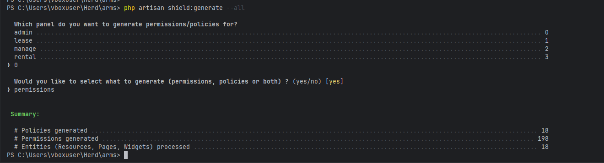

php artisan view:clear

php artisan config:clear

php artisan cache:clear

php artisan route:clear

php artisan optimize:clear

php artisan filament:cache

# shield

php artisan shield:setup

php artisan shield:generate --all

php artisan shield:super-admin --user=1 --panel=2 --tenant=2

php artisan scout:flush "App\Models\Property"

php artisan migrate:fresh --seed
